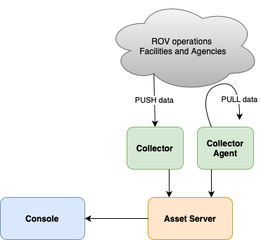

# Asset Tracking

This is a proof-of-concept demonstration of how D3 can be used to do near-real-time data visualization
of a data model held on a web service and retrieved via HTTP. It is "near" real time because there is a time lag
(on the order of one second) between arrival of data updates at the server and the screen update on the client.

The focus of the POC is learning how D3 works, since this is my first time using it. Therefore, the rest of the system
is simplified -- the server code is written in Python and implements a restricted API, with in-memory data structures
representing the model. Test data is injected using shell scripts.

To exercise the demo, do the following:
1. clone the repo to your desktop
1. run the Asset Server with shell commands: "python3 AssetServer.py3"
1. show the console in your browser by opening http://localhost:8001/console/console.html
1. inject test data into the model: "sh demo/test_data_injector.sh"

(This should cause the metadata displayed in the Console to update every few seconds,
with the globe display panning automatically to show the matching asset location.)

In a real-world implementation of such an asset tracking system, there would be more components:

Console - HTML web page using JavaScript, CSS, and D3 to visualize asset data from Asset Server.

Asset Server - In the real world this might use Spring Boot, Java, Hibernate ORM and MySQL to store Asset data
and provide clients a REST interface to access it. It would have a RESTful API, both for accepting data updates
and for fielding requests from Console.

Collector - This could be a Java/Jetty web service that remote stations call to deliver data. Since different
assets would send data in different formats, the Collector component would have a set of reusable software
components designed to handle the different data packages it receives and normalize it so it can be forwarded
on toe the Asset Server.

Collector Agent - Some assets and facilities might need to be polled on a schedule or to have data downloaded
using a pull model (such as retrieving data from an watch folder or FTP site). To this end, the data collection
agent would have file-transfer, data transform, and scheduling facilities.
